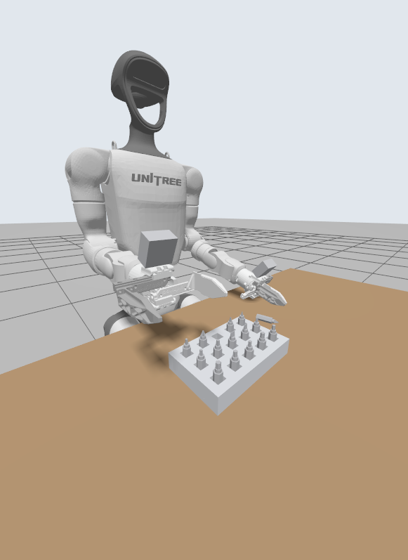
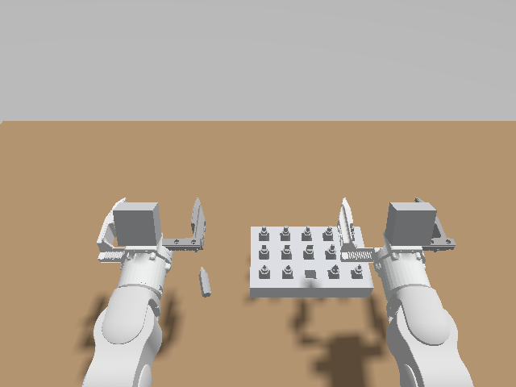
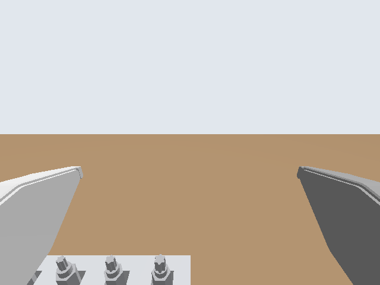

# G1 bit-tray manipulation environment

A Gazebo simulation of a **Unitree G1 humanoid with Dex1-1 parallel grippers** standing at a table. On the table is a **screwdriver-bit tray** with one empty hole, and next to it the **loose bit that belongs in that hole**. The robot has a RealSense **D435i on its head** and a RealSense **D405 on each wrist**. You control it through ROS 2.

This repo is only the environment: robot, scene, sensors and controllers. Your task will be given to you separately.

| Scene | Head camera (D435i) | Right wrist camera (D405) |
|---|---|---|
|  |  |  |

---

## 1. Requirements

| | |
|---|---|
| OS | **Ubuntu 24.04** (Noble), installed natively. ROS 2 Jazzy does not support other Ubuntu versions. Virtual machines and WSL usually lack the GPU acceleration Gazebo needs. |
| ROS | **ROS 2 Jazzy** |
| Simulator | **Gazebo Harmonic** (installed with the ROS packages below) |
| Hardware | Any GPU with working OpenGL 3.3+ drivers (Intel, AMD or NVIDIA), 8 GB+ RAM, about 3 GB disk for ROS + Gazebo |

Both X11 and Wayland desktops work. The launch file runs the Gazebo GUI through XWayland on Wayland.

## 2. Install the prerequisites (once per machine)

### 2.1 ROS 2 Jazzy

These steps follow the [official ROS 2 Jazzy install guide](https://docs.ros.org/en/jazzy/Installation/Ubuntu-Install-Debs.html). If a step fails, check the guide for changes.

```bash
# Locale (skip if `locale` already shows UTF-8)
sudo apt update && sudo apt install -y locales
sudo locale-gen en_US en_US.UTF-8
sudo update-locale LC_ALL=en_US.UTF-8 LANG=en_US.UTF-8
export LANG=en_US.UTF-8

# ROS 2 apt repository
sudo apt install -y software-properties-common curl
sudo add-apt-repository -y universe
export ROS_APT_SOURCE_VERSION=$(curl -s https://api.github.com/repos/ros-infrastructure/ros-apt-source/releases/latest | grep -F "tag_name" | awk -F\" '{print $4}')
curl -L -o /tmp/ros2-apt-source.deb "https://github.com/ros-infrastructure/ros-apt-source/releases/download/${ROS_APT_SOURCE_VERSION}/ros2-apt-source_${ROS_APT_SOURCE_VERSION}.$(. /etc/os-release && echo ${UBUNTU_CODENAME:-${VERSION_CODENAME}})_all.deb"
sudo dpkg -i /tmp/ros2-apt-source.deb

# ROS 2 Jazzy desktop + build tools (colcon, rosdep)
sudo apt update && sudo apt upgrade -y
sudo apt install -y ros-jazzy-desktop ros-dev-tools
```

Source ROS in every new terminal (or add the line to your `~/.bashrc`):

```bash
source /opt/ros/jazzy/setup.bash
```

### 2.2 This repo's dependencies (Gazebo, ros2_control, ...)

`rosdep` reads `src/g1_gazebo/package.xml` and installs everything the package needs, including Gazebo Harmonic, `ros_gz`, `gz_ros2_control` and `ros2_controllers`:

```bash
sudo rosdep init        # first time on this machine only; an "already initialized" error is fine
rosdep update

cd <path-to-this-repo>
rosdep install --from-paths src --ignore-src -y
```

## 3. Build

```bash
cd <path-to-this-repo>
source /opt/ros/jazzy/setup.bash
colcon build
source install/setup.bash
```

Re-run `colcon build` after changing any file under `src/`. You can add `--symlink-install` so edits to Python, launch and config files apply without rebuilding.

## 4. Run

```bash
source /opt/ros/jazzy/setup.bash
source install/setup.bash
ros2 launch g1_gazebo g1_table.launch.py
```

After about 10–20 s, the Gazebo window shows the robot at the table, and the terminal prints `Configured and activated right_gripper_controller`. The sim starts running immediately.

- **Headless** (no GUI; the cameras still work): `ros2 launch g1_gazebo g1_table.launch.py gui:=false`
- **Stop:** `Ctrl+C` in the launch terminal.

### Check that it works

In a second terminal (source both setup files first):

```bash
ros2 control list_controllers
# 6 controllers, all "active": joint_state_broadcaster, body_controller, left/right_arm_controller, left/right_gripper_controller

ros2 topic hz /head_camera/color/image_raw     # ~15-30 Hz, depending on your machine

# Close, then open, the left gripper; you should see it move in Gazebo
ros2 topic pub --once /left_gripper_controller/commands std_msgs/msg/Float64MultiArray "{data: [-0.02, -0.02]}"
ros2 topic pub --once /left_gripper_controller/commands std_msgs/msg/Float64MultiArray "{data: [0.0245, 0.0245]}"
```

To view the camera images: `ros2 run rqt_image_view rqt_image_view` and pick a topic. RViz (`rviz2`) also works; set the fixed frame to `world`.

---

## 5. Environment reference

### 5.1 Coordinates

- The world frame `world` sits on the floor directly below the robot's pelvis.
- **+x** points forward (toward the table), **+y** to the robot's left, **+z** up.
- Units are meters and radians.

### 5.2 Robot

- **Model:** Unitree G1, 29 DoF (mode 15), with Dex1-1 two-finger grippers. The URDF is Unitree's `g1_29dof_mode_15_with_dex1_1.urdf`, unmodified. Everything specific to the simulation is added at launch in [robot_description.py](src/g1_gazebo/g1_gazebo/robot_description.py).
- **Fixed base:** the pelvis is welded to the world at (0, 0, 0.793) m, the standing height. The robot never falls over and you don't need a balance controller. Only the arms, waist, legs and grippers move.
- **Start pose:** all body joints at 0, which points the forearms straight forward over the table, with both grippers open.
- **Joint limits:** see the `<limit>` tags in the [URDF](src/g1_gazebo/robots/g1_description/g1_29dof_mode_15_with_dex1_1.urdf). The simulated joints physically stop at these limits. The controllers don't clamp commands, so keep your targets inside the limits.

All joints are **position controlled** through [ros2_control](https://control.ros.org):

| Controller | Type | Joints | Command interface |
|---|---|---|---|
| `left_arm_controller` | JointTrajectoryController | `left_shoulder_pitch_joint`, `left_shoulder_roll_joint`, `left_shoulder_yaw_joint`, `left_elbow_joint`, `left_wrist_roll_joint`, `left_wrist_pitch_joint`, `left_wrist_yaw_joint` | topic `/left_arm_controller/joint_trajectory` or action `/left_arm_controller/follow_joint_trajectory` |
| `right_arm_controller` | JointTrajectoryController | same as the left arm, with `right_` | same as the left arm, with `right_` |
| `left_gripper_controller` | JointGroupPositionController | `left_dex1_finger_joint_1`, `left_dex1_finger_joint_2` | topic `/left_gripper_controller/commands` (`std_msgs/Float64MultiArray`, 2 values) |
| `right_gripper_controller` | JointGroupPositionController | `right_dex1_finger_joint_1`, `right_dex1_finger_joint_2` | topic `/right_gripper_controller/commands` |
| `body_controller` | JointTrajectoryController | 12 leg joints + `waist_yaw_joint`, `waist_roll_joint`, `waist_pitch_joint` | topic `/body_controller/joint_trajectory`; holds the standing pose |
| `joint_state_broadcaster` | JointStateBroadcaster | all 33 joints | publishes `/joint_states` |

**Gripper fingers:**
- Each finger is a prismatic joint. `0.0245` is fully open (about 95 mm between the finger pads), `-0.02` is fully closed.
- Always command both fingers with the same value.
- The fingers push with up to 20 N, which is enough to hold the bits when closed on them.

**Example: move the left arm over 2 s.** This lowers the left gripper to about 3 cm above the table, next to the loose bit:

```bash
ros2 topic pub --once /left_arm_controller/joint_trajectory trajectory_msgs/msg/JointTrajectory "{
  joint_names: [left_shoulder_pitch_joint, left_shoulder_roll_joint, left_shoulder_yaw_joint,
                left_elbow_joint, left_wrist_roll_joint, left_wrist_pitch_joint, left_wrist_yaw_joint],
  points: [{positions: [0.1, 0.0, 0.0, 0.2, 0.0, 0.0, 0.0], time_from_start: {sec: 2}}]}"
```

**TF:** `robot_state_publisher` publishes the full link tree on `/tf` and `/tf_static`, rooted at `world`. Useful frames:
- `pelvis`, `torso_link`
- `left_wrist_yaw_link` / `right_wrist_yaw_link`
- `left_dex1_base_link` / `right_dex1_base_link`: gripper base; +x points along the fingers, and the fingers close along ±y.
- `left_dex1_finger_link_1/2`, `right_dex1_finger_link_1/2`
- The camera frames listed below.

### 5.3 Cameras

| Camera | Mount | Sensor | Frame id |
|---|---|---|---|
| Head **D435i** | Stock G1 head mount `d435_link` (0.43 m above the torso, pitched 47.6° down) | RGB-D, 640×480 @ 30 Hz, 69.4° horizontal FOV, depth 0.1–10 m; IMU @ 200 Hz | `head_camera_optical_frame` (IMU: `d435_link`) |
| Wrist **D405** (×2) | On top of each Dex1 gripper base, pitched 26° down toward the fingertips | RGB-D, 640×480 @ 30 Hz, 87° horizontal FOV, depth 0.07–1 m | `left_wrist_camera_optical_frame`, `right_wrist_camera_optical_frame` |

Topics (`<cam>` is `head_camera`, `left_wrist_camera` or `right_wrist_camera`):

| Topic | Type | Notes |
|---|---|---|
| `/<cam>/color/image_raw` | `sensor_msgs/Image` | `rgb8` |
| `/<cam>/color/camera_info` | `sensor_msgs/CameraInfo` | intrinsics |
| `/<cam>/depth/image_rect_raw` | `sensor_msgs/Image` | `32FC1`, meters, aligned pixel-for-pixel with the color image; out of range = `inf`/`nan` |
| `/<cam>/depth/camera_info` | `sensor_msgs/CameraInfo` | same intrinsics as color |
| `/<cam>/depth/color/points` | `sensor_msgs/PointCloud2` | XYZRGB; computed only while something subscribes |
| `/head_camera/imu` | `sensor_msgs/Imu` | D435i IMU |

Optical frames use the ROS convention: z forward, x right, y down.

### 5.4 Scene objects

| Gazebo model | What | Where (world frame) | Details |
|---|---|---|---|
| `table` | Table, **static** | Top surface at z = 0.75 m, front edge at x = 0.15 m, spans x 0.15–0.75, y −0.6–0.6 | 0.6 × 1.2 m |
| `bit_tray` | Bit holder, **static** (fixed to the table) | Center (0.37, −0.06), bottom at z = 0.75 | 110 × 178 × 30 mm. 3 rows × 5 columns of square holes, 16 mm wide, 24 mm deep, 34 mm apart. |
| `bit_*` (14) | Screwdriver bits standing in the tray, tip up | Hole centers at x ∈ {0.336, 0.370, 0.404}, y ∈ {−0.128, −0.094, −0.060, −0.026, 0.008}. The holes nearest the robot are at x = 0.336. | Tip types PH0/1/3, SL3/4/5, H2/3/4, T10/15/20, SQ1/2. Standing in the tray, a bit sticks 26 mm out of the top. |
| — | **Empty hole** | (0.336, −0.060): front row (nearest the robot), middle column | |
| `bit_ph2_loose` | The **PH2 bit** that belongs in the empty hole, lying flat on the table | Center about (0.34, 0.10, 0.756), tip pointing forward (+x), yawed 0.25 rad | |

All bits are movable, and 2× real size so the Dex1 gripper can hold them:
- 12 mm hexagonal shank and 50 mm total length (36 mm shank + 14 mm tip), 42 g.
- Friction coefficient 0.8.
- The model origin is at the flat end of the shank, with +z pointing toward the tip.

**Moving the loose bit:** the bit always starts at the same pose; nothing randomizes it. To test your system at other poses, move the bit while the simulation is running:

```bash
# center at x = 0.36 m, y = 0.12 m, tip pointing along yaw = 0.8 rad (0 = +x, away from the robot)
ros2 run g1_gazebo move_loose_bit.py 0.36 0.12 --yaw 0.8
```

This lays the bit flat on the table at that pose. You can also drag it with the move and rotate tools in the Gazebo GUI toolbar. To change the starting pose permanently, edit `LOOSE_BIT_CENTER` / `LOOSE_BIT_YAW` in `scripts/generate_scene_assets.py` (see section 6).

**Ground-truth poses** are not published to ROS; the robot is meant to perceive the objects through its cameras. You can still query them from Gazebo for debugging:

```bash
gz model -m bit_ph2_loose -p      # position + roll/pitch/yaw of the loose bit
gz model --list                   # all model names
```

### 5.5 Simulation details

- **Physics:** DART, 1 ms step.
- **Controllers:** the controller manager runs at 500 Hz. Position commands are tracked by setting joint velocities, limited by each joint's effort limit.
- **Real-time factor:** about 0.5–0.8× on a typical laptop with all three cameras on. The GUI clock shows it. Sim time is published on `/clock`, and all nodes here use `use_sim_time: true`; do the same in your own nodes.
- **Why the tray is static:** a movable tray links all 14 bits into one large contact problem, and the sim drops to about 5% of real time.

---

## 6. Repository layout

```
.
├── README.md
├── docs/                                 images used in this README
└── src/g1_gazebo/                        the ROS 2 package
    ├── launch/g1_table.launch.py         starts Gazebo, spawns the robot, bridges topics, loads controllers
    ├── g1_gazebo/robot_description.py    builds the simulated robot: Unitree URDF + fixed base, cameras, ros2_control
    ├── config/g1_controllers.yaml        controller definitions
    ├── config/ros_gz_bridge.yaml         Gazebo -> ROS topic mapping (cameras, IMU, clock)
    ├── worlds/g1_table.sdf               the world (generated)
    ├── models/                           bit tray + 15 bit models (generated)
    ├── scripts/generate_scene_assets.py  generates worlds/ and models/
    ├── scripts/move_loose_bit.py         moves the loose bit in a running simulation
    └── robots/g1_description/            Unitree G1 + Dex1-1 URDF, meshes, Unitree license
```

To change the scene (object positions, tray layout, bit sizes), edit the constants at the top of `scripts/generate_scene_assets.py`, then run:

```bash
python3 src/g1_gazebo/scripts/generate_scene_assets.py && colcon build
```

## 7. Troubleshooting

| Symptom | Fix |
|---|---|
| `Package 'g1_gazebo' not found` | Run `source install/setup.bash` in the repo root, after `colcon build`. |
| `Package 'ros_gz_sim' not found`, or a missing controller type | Dependencies are missing: run the `rosdep install` step in section 2.2 again. |
| GUI window crashes, stays black, or shows `Unable to create the rendering window` | The GPU driver or OpenGL isn't working. Run `glxinfo -B` (from `mesa-utils`) and check that it reports your GPU, not `llvmpipe`. Update your GPU drivers. The simulation keeps running without the GUI, and `gui:=false` skips it. |
| Controllers never become active, or `Waiting for data on 'robot_description'` repeats | A previous run is probably still running. Stop it with `pkill -f "gz sim"`, then `ros2 daemon stop`, and launch again. |
| The robot moves in slow motion | The sim is running slower than real time (see 5.5). Close other GPU-heavy apps. Always use sim time (`/clock`) in your code, not wall time. |
| `rosdep init` says it is already initialized | That's fine; continue with `rosdep update`. |

## 8. Credits

The Unitree G1 URDF and meshes in `src/g1_gazebo/robots/g1_description/` come from [unitree_ros](https://github.com/unitreerobotics/unitree_ros) (BSD 3-Clause, © Unitree Robotics, see the `LICENSE` file there).
